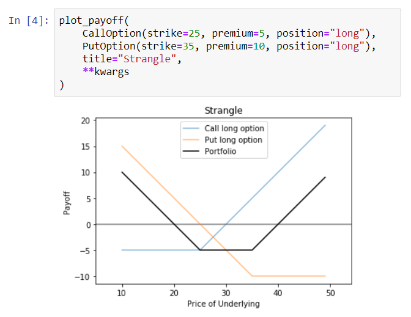

# Fimod

> Educational and analytical tool to model how financial instruments work

> Finance, Educational

---

## Installation

- Clone or download the source code this repo to your local machine using `https://github.com/Miksus/fimod.git`

---

## Features
- Calculations for option price
- Simple interface for plotting payoffs

## Usage
> Please see [demo](demo.ipynb)

## Test
Pytest was chosen as testing suites. Tests are found in tests directory. 

---

## Author

* **Mikael Koli** - [Miksus](https://github.com/Miksus) - koli.mikael@gmail.com

---
## License

- **[MIT license](http://opensource.org/licenses/mit-license.php)**
- Copyright 2019 © Mikael Koli